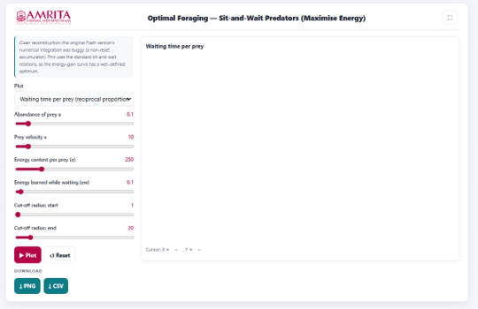
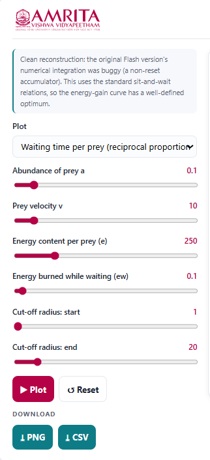
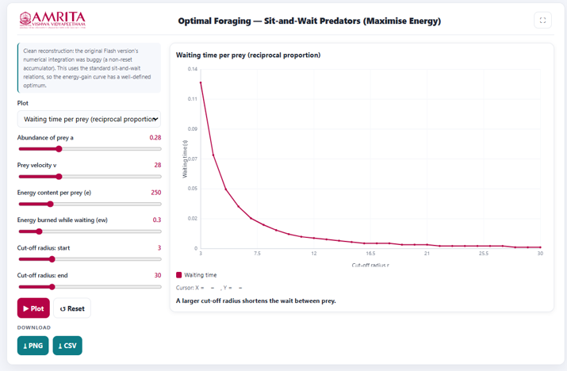

### Procedure

1. The simulator enables users to investigate the foraging strategy of a sit-and-wait predator by examining the relationship between prey availability, detection distance, waiting time, and energetic gain. Users can configure ecological and energetic parameters, generate graphical outputs, and evaluate conditions that maximize the predator's net energy intake.

 
&nbsp;

2. The simulator consists of a parameter panel on the left and a graphical visualization panel on the right. 

 
&nbsp;

3. Read the introductory information displayed at the top of the parameter panel. This section provides a brief description of the simulation model and indicates that the simulator is based on the standard sit-and-wait predator model for analysing energy gain. 
 
&nbsp;

4. Select the desired graph from the Plot drop-down menu. The simulator provides different graphical analyses for evaluating various aspects of the sit-and-wait predator's foraging behaviour. 
 
&nbsp;

5. Specify the abundance of prey (a) using the corresponding slider. This parameter represents the density or availability of prey within the habitat. 
 
&nbsp;

6. Adjust the prey velocity (v) using the corresponding slider. This parameter defines the average speed at which prey move through the predator's environment. 

&nbsp;

7. Specify the energy content per prey item (e) using the corresponding slider. This parameter represents the amount of energy obtained by the predator after successfully capturing a prey item. 
 
&nbsp;

8. Adjust the energy burned while waiting (ew) using the corresponding slider. This parameter specifies the energetic cost incurred by the predator while remaining stationary and waiting for prey. 
 
&nbsp;

9. Specify the starting cut-off radius using the Cut-off radius: start slider. This parameter defines the minimum detection or capture radius considered during the simulation. 
 
&nbsp;

10. Specify the ending cut-off radius using the Cut-off radius: end slider. Together with the starting value, this parameter defines the range of detection radii over which the simulation is performed. 
 
&nbsp;

11. After configuring all simulation parameters, click the Plot button to generate the selected graphical output. 

 
&nbsp;

12. Observe the graph displayed in the visualization panel. The graph illustrates the variation in the waiting time per prey as the predator's cut-off radius changes.
 
&nbsp;

13. Interpret the X-axis (Cut-off radius, r) to examine the predator's detection or capture radius used during the simulation. Interpret the Y-axis (Waiting time, s) to determine the average time the predator must wait before encountering a prey item.
 
&nbsp;

14. Observe the trend of the curve to determine how waiting time changes with increasing cut-off radius. Compare the waiting time at smaller cut-off radii with that observed at larger cut-off radii.
 
&nbsp;

15. Identify the region where the waiting time decreases rapidly and the point beyond which further increases in the cut-off radius produce only marginal reductions in waiting time.
 
&nbsp;

16. Read the interpretation message displayed below the graph. This message summarizes the simulation results and explains how increasing the cut-off radius influences the time required to encounter prey.
 
&nbsp;

17. Move the cursor over the graph, if required, to display the corresponding coordinate values shown beneath the graph. These values indicate the waiting time associated with a specific cut-off radius.
 
&nbsp;

18.	Modify one or more simulation parameters, such as prey abundance, prey velocity, energy content per prey, energy burned while waiting, or the cut-off radius range, and generate the graph again to investigate how these ecological factors influence prey encounter rates and waiting time.
 
&nbsp;

19. If required, click the Reset button to restore the default simulation parameters before performing another simulation.
 
&nbsp;

20. Download the graphical output by clicking the PNG button or export the numerical simulation data by clicking the CSV button for further analysis and comparison.
 
&nbsp;

21.	Repeat the above procedure using different parameter combinations to compare predator waiting times under varying ecological conditions and identify the cut-off radius that provides the most efficient balance between prey encounter frequency and energetic expenditure.

 
&nbsp;

