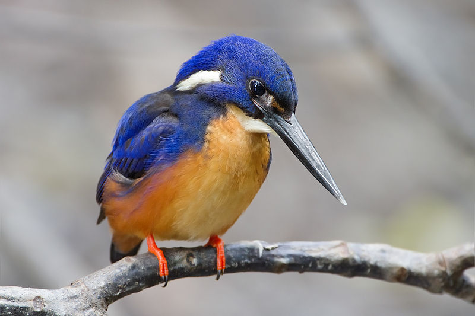
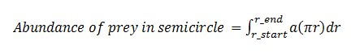
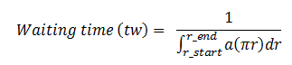
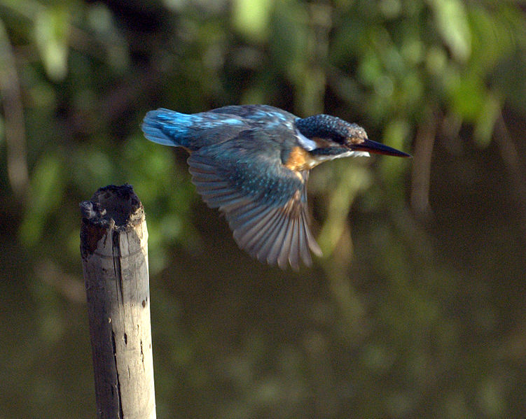
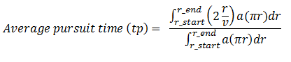
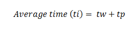
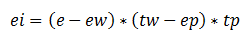
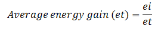

&nbsp;

One of the main classical concerns of ecology is foraging behavior. Optimal foraging illustrates the organisms forage in such a way as to maximize their net energy intake per unit time.  It was first proposed by Robert MacArthur, J M Emlen, and Eric Pianka in 1966. The first assumption of the optimal foraging theory is natural selection will only favor behavior that maximizes energy return.
 

The population density of predators mainly depends upon their food. That means predators who hunt more efficiently will get more than their actual share and thus can produce many offspring than others. (It includes finding /catching /killing their prey). It is evident that the hunting behavior of organisms is more efficient with regard to energy or time expended in hunting.

&nbsp;

#### Modes of Foraging:

Foraging mode is a very important aspect of life history, and it is generally associated with characteristics such as reproductive effort, risk of predation, energy budget and locomotor mode. Classification of foraging mode can be useful because of these life-history associations.

Optimal foraging theory helps biologist to understand the factors determining a consumer’s operation range of food types.  Predators have been described into two categories based on its foraging strategies: searching (active or ‘widely foraging’) and sit-and-wait or ambush. A searching predator moves throughout its habitat and find its prey. That means actively foraging predators are characterized by their frequent wandering movements. A sit-and-wait predator waits or remains still for long periods of time to capture its prey as it appears before them. That is some predators attack their prey from ambush, whereas others mainly hunt while on the move. Pianka (1966) named these two strategies of foraging the "sit-and-wait” and "widely-foraging" respectively. There is striking difference in foraging pattern between these two groups. Foraging mode is an important characterizing trait of predators and may correlate with behavioral, ecological, physiological, and morphological characteristics. It is clear that the natural consequential impact on optimal foraging theory and competitive relationships among species.

There are some conditions required to support these two modes of foraging. A sit-and-wait strategy is mostly relying on moving preys or high prey mobility and the prey density must be relatively high. In order to favor the sit-and-wait tactic, predator’s energy requirements must be low. Whereas searching predators encounter and consume non-moving types of prey population. The success of widely foraging pattern of ‘searchers’ is also influenced by prey density and prey mobility along with the predator's energetic requirements. Generally it should be higher than those of sit-and-wait predators. However the searching abilities of the predator and the spatial distribution of its prey are paramount. The sit-and-wait foraging mode is less common during periods of prey scarcity than the widely-foraging pattern.  Some common examples of ambush predators include snakes, fish and other reptiles such as crocodiles as well as birds, some mammals and spiders.

 
It has been studied that there are some general correlates between these foraging modes in the case of desert lizard species. Huey and Pianka (1981) compiled many of these ecological correlates of foraging tactics. (Refer the experiment 'Optimal Foraging: Searching Predators that Maximize Energy' in Population Ecology lab II)

&nbsp;

#### A Case of Sit-and-wait Predator that Maximize Energy:

As explained, there are two general categories of predators:  sit-and-wait and active. The main objective of this exercise is to study and analyze the behavior of a sit-and-wait predator whose optimal foraging strategy is to maximize the energy that it gains during each foraging course. A sit-and-wait predator usually waits for prey to come within striking distance. It waits in one place for long periods of time and makes decisions regarding when to hunt or when not to hunt the prey that it sees. A major part of this decision depends on how far the prey is from its predator.

To study the behavior of such a predator we can make use of the foraging strategy of a kingfisher. The Common Kingfisher hunts from a perch above the water, on a branch, beak pointing down as it seeks for prey. When food is detected, it dives steeply down to grab its prey. For example, consider a kingfisher waiting on a perch on a branch, looking down at a river and choosing which fish to go for. For the sake of understanding, let us assume that the pattern of the foraging area as a semicircle around it and the size and behavior of all the fishes are same. When a kingfisher takes decision to grab a particular fish, it dives from its perch, seizes the fish, and comeback to its perch.

Image source: http://en.wikipedia.org

 
&nbsp;

The energy spent in waiting and pursuit of the prey depends on the size of the foraging area. Increasing the size of the foraging area decreases the time and energy spent in waiting for a fish to come into sight as there is a chance of choosing more fishes. Also, increasing the size of the foraging area increases the average time and energy spent in capturing the prey, because the kingfisher has to fly longer distance to catch its prey.

As explained above, the abundance of the fish increases as the size of the foraging area (semicircle) increases. We need to know how the abundance of the prey increases as it is helpful to find the optimal size of the foraging area. It is known that the area of the semi circle is1/2 πr^2. The rate at which area changes with radius is the derivative of the area with respect to the radius, and that is πr. Therefore, on integrating the abundance per unit area will help to obtain the total abundance of the prey within that foraging area (in this case it is semicircle).

i.e.,

Where, 

**a** is the abundance of the prey per unit area, 

**r_start** and **r_end** is the starting and outer boundary of the semicircle 

**r** stands for the radius of the circle.

&nbsp;

It is explained earlier that the increasing the size of the foraging area decreases the waiting time of the kingfisher for fish to appear. That is, the waiting time is then proportional to the reciprocal of the total abundance.

We can use this formula use to calculate the waiting time of the kingfisher in seconds. Simulate the above to understand the relation between size of the foraging area and waiting time.

&nbsp;

Image source: http://en.wikipedia.org

 
&nbsp;

The time taken by the kingfisher to fly from its perch to prey (fish) is the distance (here the radius) divided by the velocity of flight, i.e., r/v . Thus, the total time it takes to fly to catch a fish and then back to its perch is 2( r/v). Therefore, the average time includes the time takes to pursue in all parts of the foraging area, from the starting point of the cut-off-radius (right next to its perch) to the outer boundary of the semicircle (foraging area). It is given by:

&nbsp;

We can simulate this to study the relation between average pursuit time and size of the foraging area.

Thus, the sum of waiting time and average pursuit time is the average time that it takes a kingfisher to get a fish.

&nbsp;

From the above formulas, we can also calculate the average energy gain that it gets for every fish it eats.

##### Energy gain = energy intake – energy spent for waiting – energy spent in pursuit

If **e** is the energy content of each fish, **ew** is the energy expenditure per second while waiting for fish, and **ep** is the energy expenditure per second during pursuit, the energy gain is given as,

Where **ei** is the energy gain.

&nbsp;

The average rate of energy gain from foraging in a semicircle of the given radius is equal to the average energy per fish divided by the average time spent for getting the prey.

&nbsp;

&nbsp;

